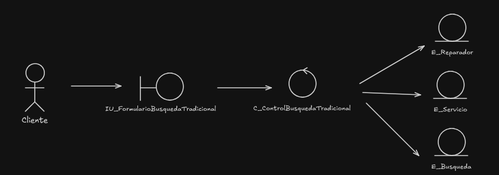

### 1. **Paquetes de Análisis del Sistema**

Estos paquetes corresponden directamente a las principales áreas funcionales que el sistema automatizado abordará, transformando los procesos de negocio manuales de Fixceler y añadiendo nuevas capacidades, como el Módulo de IA.

- **Gestión de Cuentas de Usuario:** Agrupa los CUS relacionados con el mantenimiento de la información de perfil de los usuarios (Clientes y Reparadores) una vez que han iniciado sesión.
- **Gestión de Solicitudes y Contratación:** Encapsula las funcionalidades que permiten a los clientes solicitar servicios y a los reparadores aceptar y formalizar la contratación de dichos servicios.
- **Módulo de IA (Búsqueda Inteligente):** Este paquete representa el componente innovador del sistema, dedicado al procesamiento de solicitudes en lenguaje natural y al emparejamiento inteligente de reparadores. Es una nueva capacidad disruptiva y una funcionalidad principal del módulo.
- **Gestión del Servicio:** Contiene los CUS relacionados con la fase final de un servicio, incluyendo su confirmación, la recolección de costos y la calificación.
- **Consultas de historial:** Agrupa los CUS que permiten a los usuarios consultar su historial de servicios y otros datos relevantes en la plataforma.
- **Componentes Externos:** Este paquete especial contendrá todos los componentes que no son desarrollados por el sistema directamente, sino que son consultados o integrados desde fuentes externas. Para Fixceler, estos componentes consultados incluirán servicios de mapas o geolocalización (para Consultar Ubicación en Mapa).

### 2. Proceso del Negocio: Gestión de Cuentas de Usuario
#### 2.1. Paquetes de Análisis para CUS
- Paquete del proceso del negocio:

- Paquetes para los casos de uso análisis:

#### 2.2. Clases de Análisis
##### 2.2.1. Clases Entidad

##### 2.2.2. Clases Interfaz

##### 2.2.3. Clases Control

#### 2.3. Diagrama de Clases de Análisis
##### 2.3.1. Caso de Uso: Registrar Usuario
##### - **Realización de Caso de Uso Análisis:**

##### - **Flujo de Interacción y Eventos**
- **Primer escenario: Flujo Normal:**
      1. El **[Actor: Usuario Nuevo]** accede a la opción de registro.
      2. El **[Sistema: IU_FormularioRegistro]** presenta la sección de datos generales.
      3. El **[Actor: Usuario Nuevo]** ingresa sus datos generales (nombre, email, contraseña).
      4. El **[Actor: Usuario Nuevo]** elige su tipo de cuenta/rol (Cliente o Reparador).
      5. El **[Sistema: IU_FormularioRegistro]** muestra campos adicionales requeridos para el rol seleccionado.
      6. El **[Actor: Usuario Nuevo]** termina de ingresar los datos específicos.
      7. El **[Actor: Usuario Nuevo]** confirma el envío del formulario.
      8. La **[Sistema: IU_FormularioRegistro]** envía toda la información al **[Sistema: C_ControlRegistro]**.
      9. El **[Sistema: C_ControlRegistro]** realiza la validación completa de todos los datos.
      10. El **[Sistema: C_ControlRegistro]** crea y guarda las nuevas instancias en las entidades **[Sistema: E_Usuario]**, **[Sistema: E_Perfil]** y les asocia el **[Sistema: E_Rol]** correspondiente.
      11. El **[Sistema: C_ControlRegistro]** invoca al **[Sistema: C_ControlAutenticacion]** para crear una sesión para el nuevo usuario.
      12. La **[Sistema: IU_FormularioRegistro]** recibe la confirmación y muestra un mensaje de "Registro exitoso", redirigiendo al usuario al panel principal.
- **Segundo escenario: Flujos Alternos**
   - **Escenario: Datos Inválidos (Curso Alterno 1a y 3a)**
      - Este flujo se activa en el **paso 9** del curso normal.
      - **9a.** Si cualquier dato (general o específico) es inválido, el **[Sistema: C_ControlRegistro]** rechaza la operación y devuelve un error específico a la **[Sistema: IU_FormularioRegistro]**.
      - **9b.** La **[Sistema: IU_FormularioRegistro]** muestra el mensaje de error al **[Actor: Usuario Nuevo]**, resaltando los campos que deben ser corregidos.
      - **9c.** El flujo regresa al paso correspondiente (**paso 3** para datos generales o **paso 6** para datos específicos) para que el usuario corrija la información.
##### 2.3.2. Caso de Uso: Iniciar Sesión
##### - **Realización de Caso de Uso Análisis:**

##### **Flujo de Interacción y Eventos**
- **Primer escenario: Flujo Normal**
    1. **Participantes de este escenario:**
        - **Actor:** Usuario Registrado
        - **Interfaz:** IU_FormularioLogin
        - **Control:** C_ControlAutenticacion
        - **Entidad:** E_Usuario
    2. **Secuencia de Interacción (Flujo Textual):**
        1. El **[Actor: Usuario Registrado]** accede a la pantalla de inicio de sesión.
        2. El **[Sistema: IU_FormularioLogin]** presenta los campos para las credenciales (email y contraseña).
        3. El **[Actor: Usuario Registrado]** ingresa sus credenciales y confirma la acción.
        4. La **[Sistema: IU_FormularioLogin]** envía las credenciales al **[Sistema: C_ControlAutenticacion]**.
        5. El **[Sistema: C_ControlAutenticacion]** busca en la entidad **[Sistema: E_Usuario]** al usuario por el email proporcionado.
        6. El **[Sistema: C_ControlAutenticacion]** verifica que la contraseña ingresada coincida con la almacenada para dicho usuario.
        7. El **[Sistema: C_ControlAutenticacion]** confirma la validez de las credenciales, crea una sesión y notifica el éxito a la interfaz.
        8. La **[Sistema: IU_FormularioLogin]** redirige al **[Actor: Usuario Registrado]** al panel principal de la aplicación.
- **Segundo escenario: Flujos Alternos**
    - **Escenario: Credenciales Inválidas (Curso Alterno 2a)**
        - Este flujo se activa en el **paso 6** del curso normal.
        - **6a.** Si el usuario no es encontrado en el paso 5 o la contraseña no coincide en el paso 6, el **[Sistema: C_ControlAutenticacion]** determina que las credenciales son inválidas.
        - **6b.** El **[Sistema: C_ControlAutenticacion]** notifica el error a la **[Sistema: IU_FormularioLogin]**.
        - **6c.** La **[Sistema: IU_FormularioLogin]** muestra un mensaje de error al **[Actor: Usuario Registrado]** (Ej: "Las credenciales son inválidas. Por favor, inténtelo de nuevo.").
        - **6d.** El flujo regresa al **paso 3** del curso normal, permitiendo al usuario volver a ingresar sus credenciales.

##### 2.3.3. Caso de Uso: Actualizar Información
##### - **Realización de Caso de Uso Análisis:**

##### **Flujo de Interacción y Eventos**
- **Primer escenario: Flujo Normal**
    1. **Participantes de este escenario:**
        - **Actor:** Usuario Registrado
        - **Interfaz:** IU_FormularioActualizarPerfil
        - **Control:** C_ControlPerfil
        - **Entidad:** E_Usuario, E_Perfil
    2. **Secuencia de Interacción (Flujo Textual):**
        1. El **[Actor: Usuario Registrado]** accede a la opción de editar su perfil.
        2. El **[Sistema: IU_FormularioActualizarPerfil]** solicita al **[Sistema: C_ControlPerfil]** los datos actuales del usuario para mostrarlos.
        3. El **[Sistema: C_ControlPerfil]** consulta las entidades **[Sistema: E_Usuario]** y **[Sistema: E_Perfil]** para obtener la información vigente.
        4. El **[Sistema: IU_FormularioActualizarPerfil]** muestra un formulario pre-llenado con los datos actuales.
        5. El **[Actor: Usuario Registrado]** modifica la información deseada (personal y pública) y confirma los cambios.
        6. La **[Sistema: IU_FormularioActualizarPerfil]** envía todos los datos del formulario al **[Sistema: C_ControlPerfil]**.
        7. El **[Sistema: C_ControlPerfil]** valida que los nuevos datos sean correctos y cumplan con las reglas de negocio.
        8. El **[Sistema: C_ControlPerfil]** ordena a las entidades **[Sistema: E_Usuario]** y **[Sistema: E_Perfil]** que persistan (guarden) los cambios.
        9. La **[Sistema: IU_FormularioActualizarPerfil]** recibe la confirmación de éxito y muestra un mensaje al usuario (Ej: "Tu perfil ha sido actualizado correctamente").
- **Segundo escenario:Flujos Alternos**
    - **Escenario: Rechazo por Datos Inválidos (Curso Alterno 2a)**
        - Este flujo se activa en el **paso 7** del curso normal.
        - **7a.** Si la validación de cualquier dato falla, el **[Sistema: C_ControlPerfil]** rechaza la operación y notifica el error a la **[Sistema: IU_FormularioActualizarPerfil]**.
        - **7b.** La **[Sistema: IU_FormularioActualizarPerfil]** muestra un mensaje de error específico al **[Actor: Usuario Registrado]**, indicando los campos incorrectos.
        - **7c.** La operación termina. El formulario permanece visible con los datos que el usuario había ingresado para que pueda corregirlos.

### 3. Proceso del Negocio: Módulo de IA (Búsqueda Inteligente)
#### 3.1. Paquetes de Análisis para CUS
- Paquete del proceso del negocio:

- Paquetes para los casos de uso análisis:

#### 3.2. Clases de Análisis
##### 3.2.1. Clases Entidad

##### 3.2.2. Clases Interfaz

##### 3.2.3. Clases Control

#### 3.3. Diagrama de Clases de Análisis
##### 3.3.1. Caso de Uso: Buscar Reparador (Tradicional)
##### - **Realización de Caso de Uso Análisis**

##### - **Flujo de Interacción y Eventos**
- **Primer escenario: Flujo Normal**
    1. El **[Actor: Cliente]** accede a la opción de búsqueda tradicional.
    2. El **[Sistema: IU_FormularioBusquedaTradicional]** presenta los filtros de búsqueda.
    3. El **[Actor: Cliente]** ingresa sus criterios y confirma la acción.
    4. La **[Sistema: IU_FormularioBusquedaTradicional]** envía los criterios al **[Sistema: C_ControlBusquedaTradicional]**.
    5. El **[Sistema: C_ControlBusquedaTradicional]** crea y guarda una instancia de **[Sistema: E_Busqueda]** para registrar los parámetros de esta búsqueda.
    6. El **[Sistema: C_ControlBusquedaTradicional]** consulta la entidad **[Sistema: E_Reparador]** y **[Sistema: E_Servicio]** para encontrar coincidencias.
    7. El **[Sistema: C_ControlBusquedaTradicional]** compila una lista con los perfiles de los reparadores encontrados y la asocia a la instancia de **[Sistema: E_Busqueda]**.
    8. La **[Sistema: IU_ListaResultados]** recibe la lista y la muestra al **[Actor: Cliente]**.
- **Segundo escenario: Flujos Alternos**
    - **Escenario: No se encuentran resultados (Curso Alterno 2a)**
    - **Escenario: El Cliente Cancela (Curso Alterno 1a)**
##### 3.3.2. Caso de Uso: Buscar Reparador con IA (Chatbot)
##### - **Realización de Caso de Uso Análisis**

##### - **Flujo de Interacción y Eventos**
- **Primer escenario: Flujo Normal**
    1. El **[Actor: Cliente]** abre la ventana del **[Sistema: IU_Chatbot]**.
    2. El **[Actor: Cliente]** escribe su necesidad en lenguaje natural.
    3. La **[Sistema: IU_Chatbot]** envía el texto al **[Sistema: C_ControlBusquedaIA]**.
    4. El **[Sistema: C_ControlBusquedaIA]** procesa el texto para identificar criterios.
    5. El **[Sistema: C_ControlBusquedaIA]** crea y guarda una instancia de **[Sistema: E_Busqueda]** con los criterios interpretados.
    6. El **[Sistema: C_ControlBusquedaIA]** utiliza al **[Sistema: C_ControlGeolocalizacion]** para refinar la búsqueda.
    7. El **[Sistema: C_ControlBusquedaIA]** consulta las entidades **[Sistema: E_Reparador]** y **[Sistema: E_Servicio]**.
    8. El **[Sistema: C_ControlBusquedaIA]** compila una lista de resultados y la asocia a la instancia de **[Sistema: E_Busqueda]**.
    9. La **[Sistema: IU_Chatbot]** recibe la lista y la presenta al **[Actor: Cliente]**.
- **Segundo escenario: Flujos Alternos**
    - **Escenario: No se encuentran resultados (Curso Alterno 2a)**
    - **Escenario: Petición no válida (Curso Alterno 2b)**
    - **Escenario: El Cliente Cancela (Curso Alterno 1a)**

### 4. Proceso del Negocio: Gestión de Solicitudes y Contratación
#### 4.1. Paquetes de Análisis para CUS
- Paquete del proceso del negocio:

- Paquetes para los casos de uso análisis:

### 4.2. Clases de Análisis
#### 4.2.1. Clases Entidad

#### 4.2.2. Clases Interfaz

#### 4.2.3. Clases Control

### 4.3. Diagrama de Clases de Análisis
#### 4.3.1. Caso de Uso: Solicitar Servicio
#### -**Realización de Caso de Uso Análisis**

#### -**Flujo de Interacción y Eventos**
- **Primer escenario: Flujo Normal**
    1.(Flujo Textual):**
        1. El **[Actor: Cliente]**, desde el perfil de un reparador, inicia la acción de solicitar servicio.
        2. El **[Sistema: IU_FormularioSolicitud]** presenta los campos para describir el problema y los servicios requeridos.
        3. El **[Actor: Cliente]** completa el formulario, especificando servicios, descripción y opcionalmente, un monto propuesto.
        4. El **[Actor: Cliente]** confirma el envío de la solicitud.
        5. La **[Sistema: IU_FormularioSolicitud]** envía la información al **[Sistema: C_ControlSolicitud]**.
        6. El **[Sistema: C_ControlSolicitud]** crea y guarda una nueva instancia de **[Sistema: E_Solicitud]** con estado "Pendiente", asociándola al Cliente y al Reparador.
        7. El **[Sistema: C_ControlSolicitud]** notifica al **[Actor: Reparador]** sobre la nueva solicitud (la cual aparecerá en su "buzón" o lista de solicitudes).
        8. El **[Actor: Reparador]**, a través de la **[Sistema: IU_ListaSolicitudes]**, ve la nueva solicitud y la acepta.
        9. La **[Sistema: IU_ListaSolicitudes]** informa la aceptación al **[Sistema: C_ControlSolicitud]**.
        10. El **[Sistema: C_ControlSolicitud]** actualiza el estado de la **[Sistema: E_Solicitud]** a "Aceptada".
- **Segundo escenario: Flujos Alternos**
    - **Escenario: Cliente no propone un monto (Curso Alterno 2a)**
        - En el **paso 3** del curso normal, el **[Actor: Cliente]** puede dejar el campo de monto vacío. El flujo continúa normalmente, y la **[Sistema: E_Solicitud]** se crea sin precio inicial.
    - **Escenario: Reparador no acepta la solicitud (Curso Alterno 4a)**
        - En el **paso 8** del curso normal, el **[Actor: Reparador]** puede elegir rechazar la solicitud.
        - **9a.** La **[Sistema: IU_ListaSolicitudes]** informa el rechazo al **[Sistema: C_ControlSolicitud]**.
        - **9b.** El **[Sistema: C_ControlSolicitud]** actualiza el estado de la **[Sistema: E_Solicitud]** a "Rechazada" y notifica al **[Actor: Cliente]**. El caso de uso termina.
    - **Escenario: Reparador propone renegociación (Curso Alterno 4b)**
        - En el **paso 8** del curso normal, el **[Actor: Reparador]** puede elegir "Renegociar".
        - **9a.** Esta acción inicia el caso de uso **"Negociar Precio"**.
#### 4.3.2. Caso de Uso: Verificar Solicitudes
#### -**Realización de Caso de Uso Análisis**

#### -**Flujo de Interacción y Eventos**
- **Primer escenario: Flujo Normal**
    1. El **[Actor: Reparador]** accede a su panel y selecciona la opción para ver sus solicitudes de servicio.
    2. La **[Sistema: IU_ListaSolicitudes]** solicita al **[Sistema: C_ControlSolicitud]** la lista de solicitudes pendientes.
    3. El **[Sistema: C_ControlSolicitud]** consulta la entidad **[Sistema: E_Solicitud]** buscando todas las solicitudes asociadas a ese reparador con estado "Pendiente".
    4. El **[Sistema: C_ControlSolicitud]** devuelve la lista de solicitudes encontradas.
    5. La **[Sistema: IU_ListaSolicitudes]** muestra la lista detallada de solicitudes al **[Actor: Reparador]**.
- **Segundo escenario: Flujos Alternos**
    - **Escenario: No existen solicitudes (Curso Alterno 2a)**
        - Este flujo se activa en el **paso 4** del curso normal.
        - **4a.** Si la consulta del **[Sistema: C_ControlSolicitud]** no devuelve ninguna solicitud, notifica a la interfaz.
        - **4b.** La **[Sistema: IU_ListaSolicitudes]** muestra un mensaje al **[Actor: Reparador]** (Ej: "No tienes nuevas solicitudes de servicio."). El caso de uso finaliza.
#### 4.3.3. Caso de Uso: Negociar Precio
#### -**Realización de Caso de Uso Análisis**

#### -**Flujo de Interacción y Eventos**
- **Primer escenario: Flujo Normal**
    1. Este caso de uso se inicia cuando el **[Actor: Reparador]** elige renegociar una solicitud.
    2. El **[Sistema: IU_VistaNegociacion]** presenta la solicitud y un campo para la nueva propuesta de precio.
    3. El **[Actor: Reparador]** ingresa un nuevo precio y envía la propuesta.
    4. La **[Sistema: IU_VistaNegociacion]** envía la propuesta al **[Sistema: C_ControlNegociacion]**.
    5. El **[Sistema: C_ControlNegociacion]** crea una instancia de **[Sistema: E_Propuesta]** asociada a la **[Sistema: E_Solicitud]**.
    6. El **[Sistema: C_ControlNegociacion]** notifica al **[Actor: Cliente]** sobre la nueva propuesta (aparecerá en su buzón/panel).
    7. El **[Actor: Cliente]** revisa la propuesta a través de la **[Sistema: IU_VistaNegociacion]**.
    8. El **[Actor: Cliente]** acepta la propuesta.
    9. La **[Sistema: IU_VistaNegociacion]** informa la aceptación al **[Sistema: C_ControlNegociacion]**.
    10. El **[Sistema: C_ControlNegociacion]** actualiza el estado de la **[Sistema: E_Solicitud]** a "Precio Acordado", notifica al **[Actor: Reparador]** e inicia el caso de uso "Aceptar Contrato".
- **Segundo escenario: Flujos Alternos**
    - **Escenario: Cliente Rechaza la Propuesta (Curso Alterno 3a)**
        - Este flujo se activa en el **paso 8** del curso normal.
        - **8a.** El **[Actor: Cliente]** rechaza la propuesta.
        - **8b.** La **[Sistema: IU_VistaNegociacion]** informa el rechazo al **[Sistema: C_ControlNegociacion]**.
        - **8c.** El **[Sistema: C_ControlNegociacion]** actualiza el estado de la **[Sistema: E_Solicitud]** a "Negociación Rechazada" y notifica a ambas partes. El caso de uso termina.
#### 4.3.4. Caso de Uso: Aceptar Contrato
#### -**Realización de Caso de Uso Análisis**

#### -**Flujo de Interacción y Eventos**
- **Primer escenario: Flujo Normal**
    1. Este caso de uso se inicia automáticamente después de una negociación exitosa.
    2. El **[Sistema: C_ControlContratacion]** recupera los datos de la **[Sistema: E_Solicitud]** (partes, servicio, precio acordado).
    3. El **[Sistema: C_ControlContratacion]** genera un borrador del contrato y lo presenta a ambas partes a través de la **[Sistema: IU_VistaContrato]**.
    4. El **[Actor: Cliente]** y el **[Actor: Reparador]** revisan el contrato y realizan la acción de "firmar electrónicamente" (ej: pulsar un botón de "Acepto los términos").
    5. La **[Sistema: IU_VistaContrato]** envía las confirmaciones de ambas partes al **[Sistema: C_ControlContratacion]**.
    6. El **[Sistema: C_ControlContratacion]** verifica que ambas partes han aceptado.
    7. El **[Sistema: C_ControlContratacion]** crea y guarda la instancia final de **[Sistema: E_Contrato]** con estado "Activo".
    8. El **[Sistema: C_ControlContratacion]** envía una notificación y acceso al contrato finalizado al buzón de ambos actores.
- **Segundo escenario: Flujos Alternos**
    - **Escenario: Una de las partes rechaza el contrato (Curso Alterno 2a)**
        - Este flujo se activa en el **paso 4** del curso normal.
        - **4a.** El **[Actor: Cliente]** o el **[Actor: Reparador]** elige la opción "Rechazar" o "Cancelar".
        - **4b.** La **[Sistema: IU_VistaContrato]** informa la cancelación al **[Sistema: C_ControlContratacion]**.
        - **4c.** El **[Sistema: C_ControlContratacion]** actualiza el estado de la **[Sistema: E_Solicitud]** a "Cancelada por Contrato". El caso de uso termina.

### 5. Proceso del Negocio: Gestión del Servicio y Cierre
### 5.1. Paquetes de Análisis para CUS
- Paquete del proceso del negocio:

- Paquetes para los casos de uso análisis:

### 5.2. Clases de Análisis
#### 5.2.1. Clases Entidad

#### 5.2.2. Clases Interfaz

#### 5.2.3. Clases Control

#### 5.3. Diagrama de Clases de Análisis
#### 5.3.1. Caso de Uso: Terminar Servicio
#### - **Realización de Caso de Uso Análisis**

#### - **Flujo de Interacción y Eventos**
- **Primer escenario: Flujo Normal**
    1. Un **[Actor: Usuario]** (ej: Cliente) accede a la **[Sistema: IU_VistaGestionServicio]** y selecciona la opción "Finalizar Servicio" para un contrato activo.
    2. La **[Sistema: IU_VistaGestionServicio]** envía la solicitud de finalización al **[Sistema: C_ControlCierreServicio]**.
    3. El **[Sistema: C_ControlCierreServicio]** actualiza el estado del **[Sistema: E_Contrato]** a "Finalización Pendiente" y envía una notificación al otro usuario (**[Actor: Otro Usuario]**).
    4. El **[Actor: Otro Usuario]** (ej: Reparador) ve la notificación en su **[Sistema: IU_VistaGestionServicio]** y selecciona "Confirmar Finalización".
    5. La **[Sistema: IU_VistaGestionServicio]** envía la confirmación al **[Sistema: C_ControlCierreServicio]**.
    6. El **[Sistema: C_ControlCierreServicio]** valida que ambas partes han confirmado.
    7. El **[Sistema: C_ControlCierreServicio]** actualiza el estado del **[Sistema: E_Contrato]** a "Finalizado".
    8. El sistema notifica a ambos actores que el servicio ha concluido exitosamente y habilita el caso de uso "Dar Calificación".
- **Segundo escensario: Flujos Alternos**
    - **Escenario: Se rechaza la confirmación (Curso Alterno 3a)**
        - Este flujo se activa en el **paso 4** del curso normal.
        - **4a.** El **[Actor: Otro Usuario]** selecciona la opción "Rechazar Finalización".
        - **4b.** La **[Sistema: IU_VistaGestionServicio]** informa el rechazo al **[Sistema: C_ControlCierreServicio]**.
        - **4c.** El **[Sistema: C_ControlCierreServicio]** actualiza el estado del **[Sistema: E_Contrato]** a "Disputado" y notifica al primer usuario sobre el rechazo. El caso de uso termina.
#### 5.3.2. Caso de Uso: Dar Calificación
#### - **Realización de Caso de Uso Análisis**

#### - **Flujo de Interacción y Eventos**
- **Primer escenario: Flujo Normal**
1. Tras finalizar un servicio, el sistema presenta al **[Actor: Cliente]** la opción para calificar.
2. El **[Actor: Cliente]** accede al **[Sistema: IU_FormularioCalificacion]**.
3. El **[Actor: Cliente]** ingresa una puntuación (ej: 1-5 estrellas) y un comentario para el Reparador.
4. El **[Actor: Cliente]** confirma el envío de la calificación.
5. La **[Sistema: IU_FormularioCalificacion]** envía los datos al **[Sistema: C_ControlCierreServicio]**.
6. El **[Sistema: C_ControlCierreServicio]** crea y guarda una nueva instancia de **[Sistema: E_Calificacion]**, asociándola al **[Sistema: E_Contrato]** correspondiente.
7. El **[Sistema: C_ControlCierreServicio]** recalcula y actualiza la calificación promedio en la entidad **[Sistema: E_Reparador]**.
8. La **[Sistema: IU_FormularioCalificacion]** muestra un mensaje de agradecimiento al **[Actor: Cliente]**.

### 6. Proceso del Negocio: Consultas y Reportes
#### 6.1. Paquetes de Análisis para CUS
- Paquete del proceso del negocio:

- Paquetes para los casos de uso análisis:

### 6.2. Clases de Análisis
#### 6.2.1. Clases Entidad

#### 6.2.2. Clases Interfaz

#### 6.2.3. Clases Control

### 6.3. Diagrama de Clases de Análisis
#### 6.3.1. Caso de Uso: Solicitar Historial de Servicios
#### - **Realización de Caso de Uso Análisis**

#### - **Flujo de Interacción y Eventos**
- **Primer escenario: Flujo Normal**
    1. El **[Actor: Usuario Registrado]** accede a su panel y selecciona la opción "Ver historial de servicios".
    2. La **[Sistema: IU_VistaHistorial]** notifica al **[Sistema: C_ControlConsultas]** la solicitud del historial.
    3. El **[Sistema: C_ControlConsultas]** consulta las entidades **[Sistema: E_Contrato]** y **[Sistema: E_Solicitud]** buscando todos los registros asociados al ID del usuario.
    4. El **[Sistema: C_ControlConsultas]** compila una lista ordenada de los servicios pasados y actuales, con su estado correspondiente.
    5. La **[Sistema: IU_VistaHistorial]** recibe la lista y la muestra de forma clara al **[Actor: Usuario Registrado]**.
- **Segundo escenario: Flujos Alternos**
    - **Escenario: Historial Vacío (Curso Alterno 2a)**
        - Este flujo se activa en el **paso 4** del curso normal.
        - **4a.** Si la consulta del **[Sistema: C_ControlConsultas]** no devuelve ningún registro, entrega una lista vacía a la interfaz.
        - **4b.** La **[Sistema: IU_VistaHistorial]** muestra un mensaje al **[Actor: Usuario Registrado]** ("Aún no tienes un historial de servicios.").
#### 6.3.2. Caso de Uso: Consultar Ubicación en Mapa
#### - **Realización de Caso de Uso Análisis**

#### - **Flujo de Interacción y Eventos**
**Primer escenario: Flujo Normal**

1. El **[Actor: Usuario Registrado]** accede a la configuración de su cuenta y selecciona "Ver historial de la cuenta".
2. La **[Sistema: IU_VistaHistorial]** solicita el historial de la cuenta al **[Sistema: C_ControlConsultas]**.
3. El **[Sistema: C_ControlConsultas]** consulta la entidad **[Sistema: E_LogEstadoCuenta]** buscando todos los eventos asociados al ID del usuario.
4. El **[Sistema: C_ControlConsultas]** compila una lista cronológica de los cambios de estado (Ej: "Cuenta creada", "Perfil actualizado", "Contraseña cambiada").
5. La **[Sistema: IU_VistaHistorial]** recibe la lista y la muestra al **[Actor: Usuario Registrado]**.

### 7. Componentes Externos
#### 7.1. Paquetes de Análisis para CUS
- Paquete del proceso del negocio:

- Paquetes para los casos de uso análisis:

- ### 7.2. Clases de Análisis
- #### 7.2.1. Clases Entidad

- #### 7.2.2. Clases Interfaz

- #### 7.2.3. Clases Control

- ### 7.3. Diagrama de Clases de Análisis
- #### 7.3.1. Caso de Uso: Consultar Ruta
- #### - **Realización de Caso de Uso Análisis**

- #### - **Flujo de Interacción y Eventos**
- **Primer escenario: Flujo Normal**
    1. Un **[Actor: Usuario (Cliente o Reparador)]** selecciona un contrato activo y pulsa la opción "Ver Ruta/Ubicación en tiempo real".
    2. La **[Sistema: IU_MapaRuta]** solicita la información de geolocalización al **[Sistema: C_ControlGeolocalizacion]**.
    3. El **[Sistema: C_ControlGeolocalizacion]** consulta el **[Sistema: E_Contrato]** para obtener las identidades de ambas partes y la dirección de destino.
    4. El **[Sistema: C_ControlGeolocalizacion]** obtiene la ubicación en tiempo real del reparador consultando la información del **[Sistema: E_Usuario]** correspondiente.
    5. El **[Sistema: C_ControlGeolocalizacion]** envía las coordenadas de origen (Reparador) y destino (Cliente) a la **[Componente Externo: Google Maps API]**.
    6. La **[Componente Externo: Google Maps API]** devuelve los datos de la ruta.
    7. La **[Sistema: IU_MapaRuta]** recibe los datos y los muestra en pantalla de forma diferenciada para cada actor.
    8. El sistema actualiza la ubicación periódicamente.
- **Segundo escenario: Flujos Alternos**
    - **Escenario: El Contrato se Cancela**
        - Este es un flujo de interrupción.
        - **1a.** El sistema recibe una notificación de que el contrato ha sido cancelado.
        - **1b.** El **[Sistema: C_ControlGeolocalizacion]** detiene el servicio de seguimiento.
        - **1c.** La **[Sistema: IU_MapaRuta]** muestra un aviso de que el servicio fue cancelado y cierra la vista del mapa.